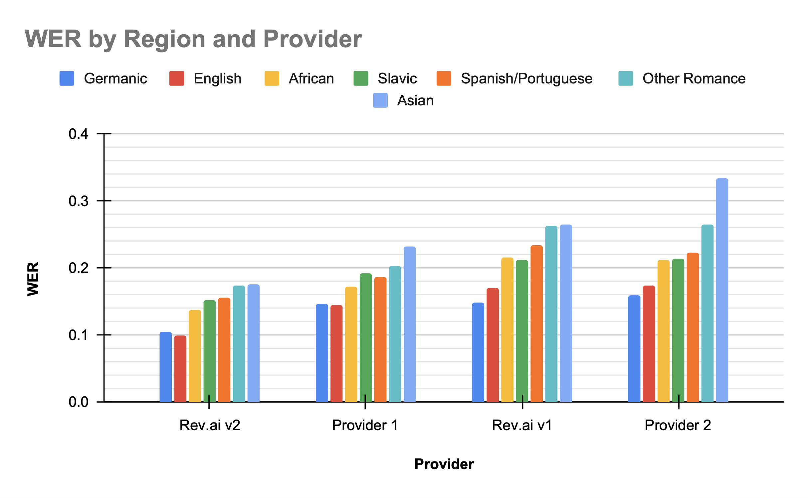

In this directory, you can find the transcripts for each recording. Results were calculated using Rev's [fstalign](https://github.com/revdotcom/fstalign) algorithm by feeding in the files in `nlp_references` and the output transcriptions from different providers.

# Results

## The _Earnings22_ Dataset
||Rev.ai Async V2|Provider 1|Rev.ai Async V1|Provider 2|
|--|--|--|--|--|
|_Earnings22_|13.8|18.1|21.0|22.8|

## WER by Region

